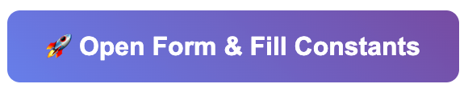

# Team Evaluation Assistant

A web-based interface for automating Google Forms team evaluations while maintaining manual control over each submission.

## Features

- **Semi-automated workflow**: Set constant values once, review each evaluation individually
- **Web interface**:
- **Form automation**: Automatically fills repetitive fields (name, email, milestone, week, team)
- **Manual review**: Full control over each team member's score and comments
- **Real-time feedback**: Visual confirmation of each step

## Quick start
#### If pulled directly from the repo. 
```bash
# sync dependencies. 
uv sync
# Start the web server
uv run uvicorn app:app --reload --host 127.0.0.1 --port 8000
```

# *IMPORTANT*
### A. Change the URL.
You can set the url in the web interface or change it on line 161 in home.html
`value="<Copy-course-form-here>`

### B. Mandatory condition
- After filling out the first page, select Start Evaluations. 
- For the application to work, the user must select "Open Form & Fill Constants"
  - Selenium requires the browser to remain open while in use.
- Continue filling out the form. the browser can even be minimized. 



## Project Structure

```
team-evaluation-assistant/
├── app.py                 # Main FastAPI application
├── templates/
│   ├── home.html         # Setup page
│   └── evaluate.html     # Evaluation interface
├── pyproject.toml        # UV project configuration
└── README.md            # This file
```

## Setup Instructions

### 1. Initialize UV Project
```bash
# Create new directory
mkdir team-evaluation-assistant
cd team-evaluation-assistant

# Initialize UV project
uv init .

# Install dependencies
uv sync
```
### if uv sync does not work, install the dependencies manually. 

`uv add fastapi uvicorn[standard] jinja2 python-multipart selenium pydantic`

### 2. Create Project Files

Create the following files in your project directory:

- `app.py` - Copy the FastAPI application code
- `templates/home.html` - Copy the home page template
- `templates/evaluate.html` - Copy the evaluation page template

### 3. Install ChromeDriver

#### This might already be intalled from previous courses. Make sure Chrome is intalled and try it. 

Download ChromeDriver from https://chromedriver.chromium.org/ and ensure it's in your PATH, or place it in your project directory.

### 4. Run the Application

```bash
# Start the web server
uv run uvicorn app:app --reload --host 127.0.0.1 --port 8000
```

## Usage

### 1. Setup (One time per milestone/week)
1. Open http://127.0.0.1:8000 in your browser
2. Fill in your constant information:
   - Your name and email
   - Current milestone and week
   - Your team
   - Google Form URL
3. Click "Start Evaluations"

### 2. Evaluate Team Members
1. Click "Open Form & Fill Constants" - this opens the Google Form and fills your info
2. Check the form to verify your information was filled correctly
3. Fill out the evaluation form in your browser:
   - Select team member name
   - Enter score (0-100)
   - Write evaluation comments
4. Click "Fill Evaluation" - this fills the team member's info in the Google Form
5. Review the complete form
6. Click "Submit Form" when ready
7. Repeat for next team member

### 3. Reset
- Click "Reset & Start Over" to change your constants or start fresh

## Troubleshooting

### Browser doesn't open
- Ensure ChromeDriver is installed and accessible
- Check that Chrome browser is installed

### Form fields not filling
- Verify the Google Form URL is correct
- Check that form structure matches expected layout
- Look at browser console for error messages

### Server won't start
- Make sure port 8000 is available
- Check that all dependencies are installed: `uv sync`

## Development

### Running in development mode:
```bash
uv run uvicorn app:app --reload
```

### Adding new team members:
Edit the dropdown options in `templates/evaluate.html` to add your actual team member names.

### Customizing the interface:
Modify the HTML templates to match your needs or add additional fields.

## Notes

- The browser window remains open during evaluations for transparency
- Each form submission opens a fresh Google Form
- All automation happens in the background while maintaining full user control
- The interface works with the standard Google Forms structure